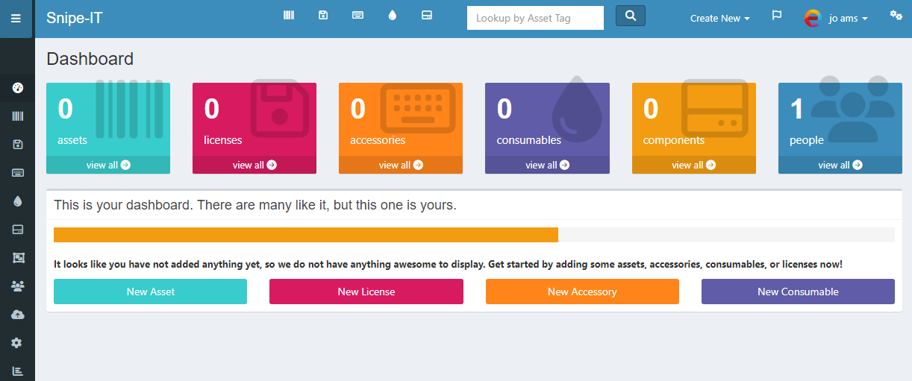

# Snipe-IT CI/CD pipeline

Deploy Snipe-IT with CI/CD on Elestio

 
 

# Once deployed ...

You can open Snipe-IT UI here:

    URL: https://[CI_CD_DOMAIN]

You can open PHPMyAdmin here:

    URL: https://[CI_CD_DOMAIN]:10468
    login: root
    password: [ADMIN_PASSWORD]

# Initial Setup

To get started, you need to create a user account. On your first visit, you can ignore the data displayed on the initial preflight page and proceed to the next step.
